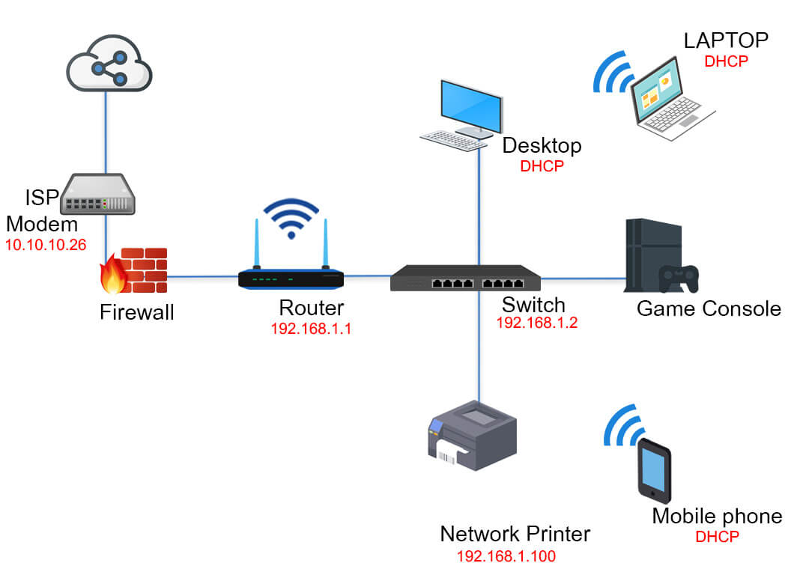

# Packet Flow

## What is Packet Flow?

Packet flow describes the journey that data takes across a network from a source device to a destination device.

A typical packet flow is:

1. A user sends a request from their computer.
2. The data is sent to a switch on the local network.
3. The switch forwards the packet to the router.
4. The router sends the packet to the Internet Service Provider (ISP).
5. The ISP routes the packet across the Internet.
6. The destination server receives the request and sends a response.
7. The response travels back to the user's computer.

## Example

PC → Switch → Router → ISP → Internet → Web Server → Response → PC

## Key Points

- Data is broken into packets.
- Routers determine the best path.
- Switches forward traffic within a local network.
- Packets may take different routes but are reassembled at the destination.
