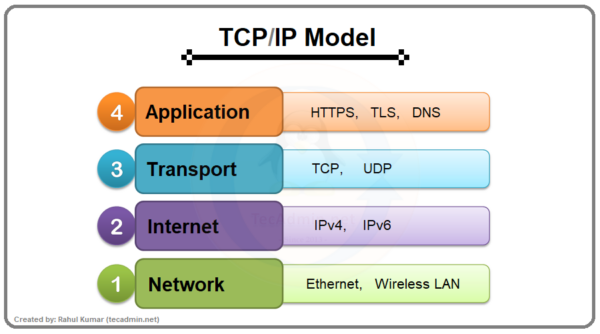

# Packet Flow

## Overview

Packet flow describes the journey that data takes across a network from a source device to its destination.

---

## Example

A user opens a web browser and enters:

www.google.com

The following steps occur:

1. The computer sends a DNS request to find Google's IP address.
2. The DNS server replies with the IP address.
3. The computer creates TCP or UDP packets.
4. The packets are sent to the router.
5. The router forwards them to the Internet.
6. The destination server receives the request.
7. The server sends a response back.
8. The browser displays the webpage.

---

## Why Packet Flow Is Important

Understanding packet flow helps network engineers and cybersecurity professionals:

- Troubleshoot network issues
- Analyse traffic
- Detect malicious activity
- Understand how data travels across networks

---

## Cybersecurity Relevance

Security analysts use tools such as Wireshark to capture and analyse packet flow, helping to identify attacks, malware, and unusual network behaviour.

---

## What I Learned

Learning packet flow has helped me understand how information moves across networks and why monitoring network traffic is essential for cybersecurity.

---
