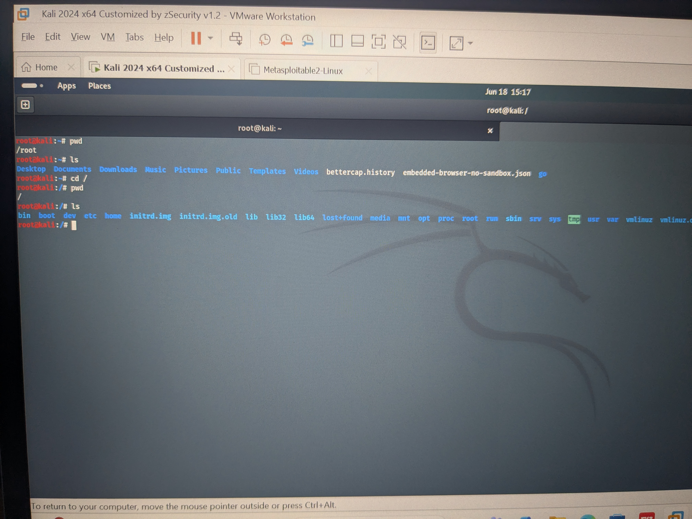

# Essential Linux Commands

## Overview

The Linux command line is one of the most powerful tools available to system administrators and cybersecurity professionals.

Unlike graphical interfaces, the command line provides fast, efficient control over the operating system and is widely used during system administration, incident response, penetration testing, and forensic investigations.

Learning these commands is a fundamental skill for anyone pursuing a career in cybersecurity.

---

## Why It Matters in Cybersecurity

Cybersecurity professionals use Linux commands every day to:

- Navigate the file system
- Investigate security incidents
- Analyse logs
- Manage users and permissions
- Troubleshoot systems
- Collect forensic evidence
- Perform network diagnostics
- Automate repetitive tasks

A solid understanding of the Linux command line improves both speed and efficiency when working in real-world environments.

---

# Essential Linux Commands

| Command | Purpose | Example |
|---------|---------|---------|
| `pwd` | Display the current working directory | `pwd` |
| `ls` | List files and directories | `ls -la` |
| `cd` | Change directory | `cd /home` |
| `mkdir` | Create a new directory | `mkdir Projects` |
| `touch` | Create a new file | `touch notes.txt` |
| `cp` | Copy files or directories | `cp file1.txt backup.txt` |
| `mv` | Move or rename files | `mv old.txt new.txt` |
| `rm` | Remove files | `rm file.txt` |
| `cat` | Display file contents | `cat notes.txt` |
| `nano` | Edit text files | `nano notes.txt` |
| `find` | Search for files | `find / -name "*.conf"` |
| `grep` | Search inside files | `grep root /etc/passwd` |
| `history` | Show previously used commands | `history` |

---

# Practical Exercise

The screenshot below demonstrates some of the Linux commands I executed in my Kali Linux virtual machine.

