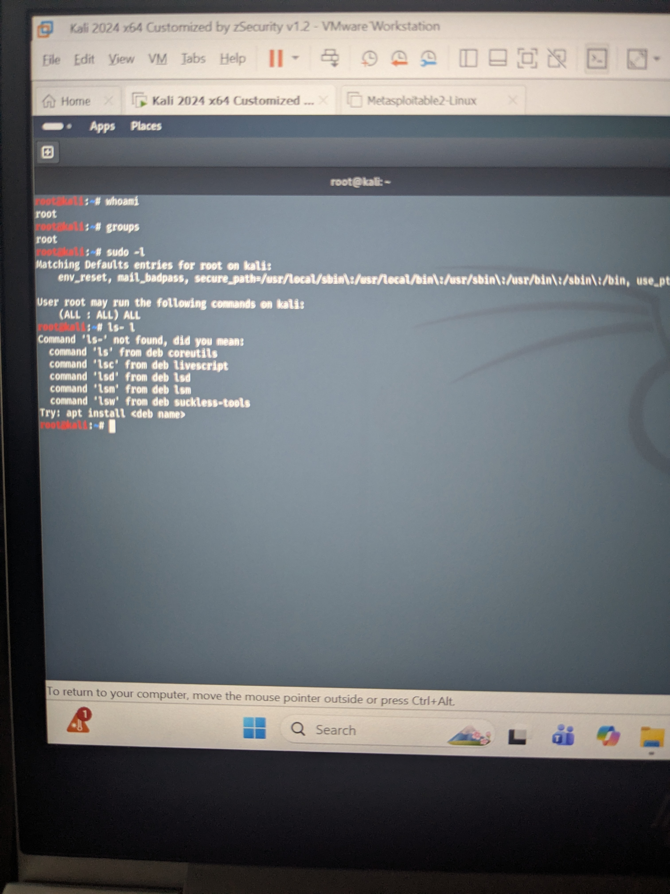

# File Ownership, Sudo and Privilege Escalation



## Objective

Understand how Linux controls administrative access using ownership, permissions and sudo privileges.

This module introduces privilege escalation, one of the most important concepts in cybersecurity.

---

# What is File Ownership?

Every file and directory in Linux has an owner and an associated group.

Ownership determines who can:

- Read files
- Modify files
- Execute programs
- Change permissions

Display ownership using:

```bash
ls -l
```

Example output:

```
-rwxr-xr-x 1 root root 4096 Jun 23 file.txt
```

The first **root** is the owner.

The second **root** is the group.

---

# Changing Ownership

Use:

```bash
sudo chown username filename
```

Example:

```bash
sudo chown kali notes.txt
```

---

# Changing Groups

```bash
sudo chgrp groupname filename
```

Example:

```bash
sudo chgrp kali notes.txt
```

---

# Using sudo

Most administrative tasks require elevated privileges.

Instead of logging in as root, Linux allows authorised users to temporarily become administrators using:

```bash
sudo
```

Example:

```bash
sudo apt update
```

sudo provides:

- Better security
- Accountability
- Reduced risk of accidental damage

---

# Who Can Use sudo?

Check your user:

```bash
whoami
```

Check groups:

```bash
groups
```

Display sudo privileges:

```bash
sudo -l
```

---

# What is Privilege Escalation?

Privilege escalation occurs when a user gains permissions they should not normally have.

There are two main types.

## Vertical Privilege Escalation

Normal user

↓

Administrator

↓

Root

---

## Horizontal Privilege Escalation

One normal user accesses another user's files or account without permission.

---

# Why Attackers Love Privilege Escalation

After compromising a system, attackers usually have limited permissions.

Their next objective is often to become root.

Common causes include:

- Weak sudo configuration
- Incorrect file permissions
- Misconfigured services
- Vulnerable software
- Weak passwords

---

# Cybersecurity Relevance

Privilege escalation is one of the most common stages in cyber attacks.

SOC Analysts monitor:

- sudo usage
- Failed privilege escalation attempts
- Authentication logs
- Suspicious processes

Penetration testers actively search for privilege escalation opportunities during security assessments.

---

# Practical Exercises

Run:

```bash
whoami
```

Run:

```bash
groups
```

Run:

```bash
sudo -l
```

Run:

```bash
ls -l
```

Take screenshots of each command.

---

# Skills Demonstrated

✔ Linux administration

✔ File ownership

✔ User privilege management

✔ sudo usage

✔ Privilege escalation fundamentals

✔ Cybersecurity concepts

---

# Reflection

Understanding file ownership and administrative privileges has shown me how Linux protects critical system resources.

Learning privilege escalation provides valuable insight into how attackers gain elevated access and how defenders detect and prevent these techniques.
