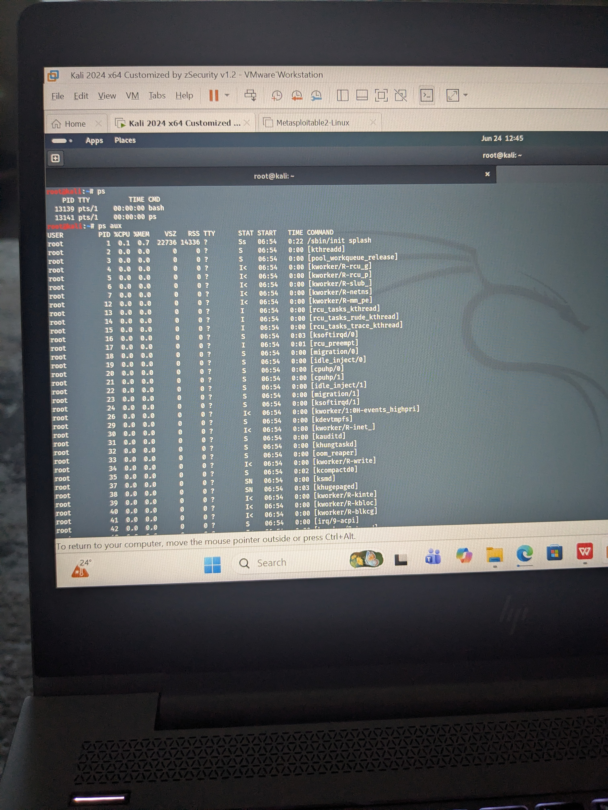
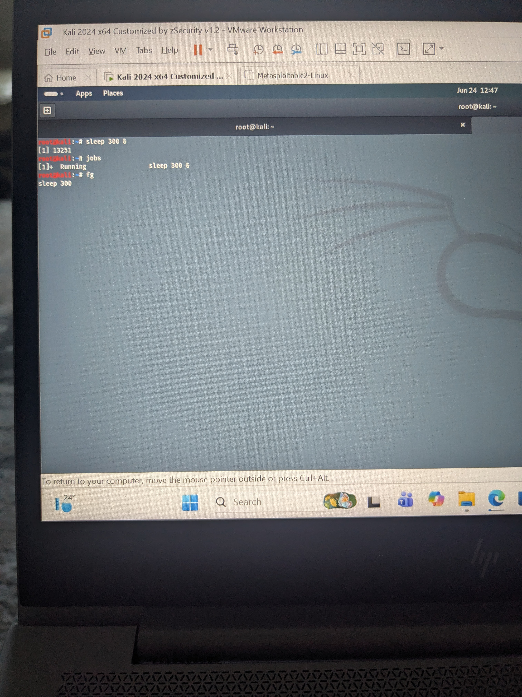

# Linux Processes and System Monitoring

## Practical Evidence

### Running Processes (ps aux)



### System Monitoring (top)


### Background Jobs



### Memory Usage


## Objective

Learn how Linux manages running processes and how to monitor, investigate and control them.

Understanding processes is essential for cybersecurity because attackers often create malicious processes or attempt to hide them from administrators.

---

# What is a Process?

A process is simply a running program.

Examples include:

- Firefox
- SSH
- Apache
- Nginx
- Bash
- Python

Every running process has its own unique Process ID (PID).

---

# Viewing Running Processes

Display all running processes:

```bash
ps -ef
```

Display only processes for the current terminal:

```bash
ps
```

---

# Real-Time Process Monitoring

Display live system activity:

```bash
top
```

If installed, a more user-friendly version is:

```bash
htop
```

htop allows you to:

- View CPU usage
- View memory usage
- Search for processes
- Kill processes interactively

---

# Understanding Process Information

Useful columns include:

PID

Process ID

USER

Owner of the process

CPU

Processor usage

MEM

Memory usage

COMMAND

Program being executed

---

# Finding Specific Processes

Search for SSH:

```bash
ps -ef | grep ssh
```

Search for Bash:

```bash
ps -ef | grep bash
```

Search for Python:

```bash
ps -ef | grep python
```

---

# Stopping Processes

Terminate a process:

```bash
kill PID
```

Force termination:

```bash
kill -9 PID
```

Terminate by name:

```bash
pkill firefox
```

---

# Managing Services

Linux services are controlled using systemctl.

Check SSH service:

```bash
systemctl status ssh
```

Start a service:

```bash
sudo systemctl start ssh
```

Stop a service:

```bash
sudo systemctl stop ssh
```

Restart a service:

```bash
sudo systemctl restart ssh
```

---

# Cybersecurity Relevance

SOC Analysts frequently investigate:

- Unknown processes
- High CPU usage
- Cryptocurrency miners
- Reverse shells
- Malware
- Persistence mechanisms

Monitoring running processes is often the first step during incident response.

---

# Practical Exercises

Run:

```bash
ps
```

Run:

```bash
ps -ef
```

Run:

```bash
top
```

Press **q** to exit.

Run:

```bash
ps -ef | grep bash
```

Run:

```bash
systemctl status ssh
```

Take screenshots of each command.

---

# Skills Demonstrated

✔ Process monitoring

✔ Linux administration

✔ Service management

✔ Incident response basics

✔ Process investigation

✔ Cybersecurity operations

---

# Reflection

Learning Linux process management has provided valuable insight into how operating systems execute applications and services.

This knowledge is fundamental for SOC Analysts because suspicious or malicious processes are often the first indicators of a cyber attack.
